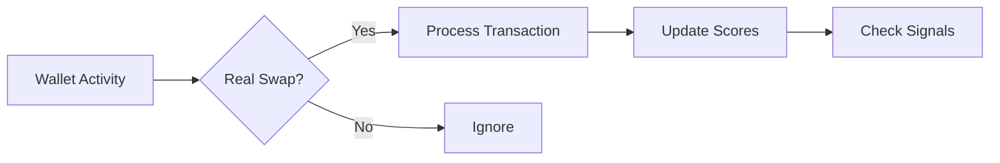
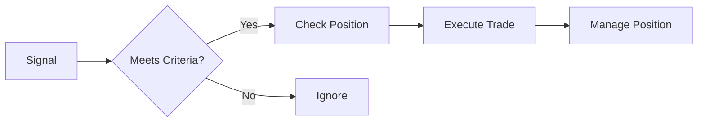

# Core Requirements for Pirate3

## Essential Features

### 1. Wallet Monitoring
```python
class WalletMonitoring:
    requirements = {
        "must_have": [
            "Track high-value wallets",
            "Detect real swaps",
            "Filter noise transactions"
        ],
        "nice_to_have": [
            "Historical analysis",
            "Pattern detection",
            "Volume tracking"
        ]
    }
```

### 2. Token Analysis
```python
class TokenAnalysis:
    requirements = {
        "must_have": [
            "AI/MEME categorization",  # This worked well
            "Score accumulation",      # This worked well
            "Signal generation"        # Core feature
        ],
        "optional": [
            "Volume analysis",
            "Price tracking",
            "Trend detection"
        ]
    }
```

### 3. Trading
```python
class Trading:
    requirements = {
        "must_have": [
            "Reliable execution",      # Critical
            "Position management",     # Critical
            "Risk controls"           # Critical
        ],
        "core_rules": {
            "entry": "Score-based signals",
            "sizing": "Category-based",
            "risk": "Clear limits"
        }
    }
```

### 4. UI/Monitoring
```python
class Interface:
    requirements = {
        "must_have": [
            "Real-time updates",
            "Position view",
            "Signal display"
        ],
        "optional": [
            "Detailed analytics",
            "Historical view",
            "Performance stats"
        ]
    }
```

## Core Flows

### 1. Transaction Detection


### 2. Trading Flow


## Critical Components

### 1. Monitor
- Track wallets
- Process transactions
- Update scores

### 2. Trader
- Handle signals
- Execute trades
- Manage positions

### 3. UI
- Show status
- Display positions
- Show signals

## What We Need vs What We Had

### Need
1. Reliable Trading:
   - Clean execution
   - Position tracking
   - Risk management

2. Good Signals:
   - Token categorization
   - Score tracking
   - Clear triggers

3. Basic UI:
   - Current status
   - Active positions
   - Recent activity

### Don't Need
1. Complex Event System:
   ```python
   # Don't need
   class EventForwarder:
       async def forward(self):
           # Complex forwarding
           pass
   
   # Need
   class Events:
       async def publish(self, event):
           # Direct handling
           pass
   ```

2. State Management:
   ```python
   # Don't need
   class StateManager:
       async def process_update(self):
           # Complex state
           pass
   
   # Need
   class State:
       async def update(self, data):
           # Direct update
           pass
   ```

3. Extra Features:
   - Complex analytics
   - Detailed histories
   - Multiple UIs

## Implementation Focus

### 1. Core Features
- Wallet monitoring
- Token analysis
- Trading execution
- Basic UI

### 2. Key Requirements
- Reliability
- Simplicity
- Maintainability

### 3. Must Haves
- Score-based signals
- Position management
- Risk controls

## Success Criteria

### 1. Monitoring
- Detect real transactions
- Track wallet activity
- Generate signals

### 2. Trading
- Execute reliably
- Manage positions
- Control risk

### 3. System
- Stable operation
- Error recovery
- Basic monitoring

## Next Steps

### 1. Design
- Core components
- Simple interfaces
- Clear flows

### 2. Implementation
- Essential features
- Basic UI
- Testing

### 3. Validation
- Signal accuracy
- Trading reliability
- System stability

## Remember

### 1. Keep It Focused
- Essential features only
- Simple implementation
- Clear boundaries

### 2. Build for Reliability
- Error handling
- Recovery paths
- Monitoring

### 3. Start Simple
- Core features first
- Add as needed
- Test thoroughly
